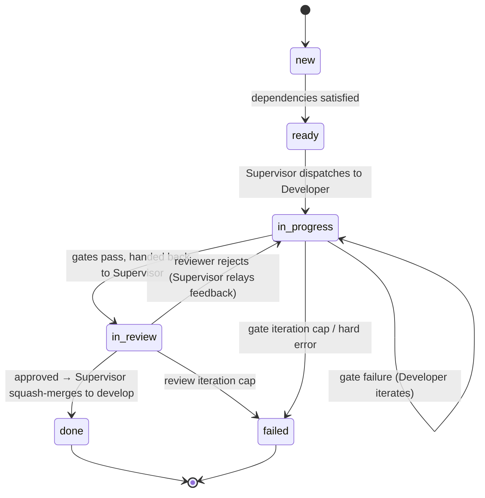

# Architecture (MVP)

> Low-fidelity. Details belong in subsequent plans.

## Foundations

- **Rust** — the implementation language.
- **Tokio** — the async runtime.
- **kameo** — the actor framework, layered on Tokio. Supervision is
  the cornerstone of fault tolerance: every long-lived component
  runs as a supervised actor; failures are scoped to the actor that
  produced them and recovered by its supervisor.
- **ratatui** — the TUI library.

## Crates

- **`makina-core`** — orchestrator library. Owns the actor topology
  (Supervisor, Planner, Developer, Reviewer), the task lifecycle and
  state machine, the worktree manager, configuration loading (see
  *Configuration*), the **agent-backend trait**, and the
  `makina-core::api` query/command/event surface the TUI consumes.
- **`makina-acp`** — the ACP implementation of the agent-backend
  trait. Subprocesses an ACP-compatible CLI and speaks the protocol
  over stdio. Separated from core so the agent protocol can be
  swapped later without touching the actors.
- **`makina`** — the `ratatui` TUI and the system's **entry point**.
  Presentation only, but it's how the user starts: a file browser
  opens a task list, which becomes a **Run** in the left sidebar (one
  Run per opened task list, backed by its `.tasks/{slug}.json`). From
  there the TUI shows per-task live status and streams the prompts
  and answers exchanged through the agent backend for whichever agent
  the user is focused on.

## Actors

A **star topology**: the Supervisor is the hub; the Planner,
Developers, and Reviewer are spokes that talk only to the Supervisor
— never to each other. Coordination, worktree/branch lifecycle, and
`.tasks/` mutation all live in one place.

- **Supervisor** (one, the hub) — persists the task graph, picks
  ready tasks, creates a per-task worktree and branch, hands tasks
  to Developers, relays completed work to the Reviewer, and on
  approval squash-merges into `develop` and tears the worktree down.
  On rejection, relays the Reviewer's feedback back to the Developer.
  Its logic is a mix of **deterministic steps and agent prompts** —
  mechanical where the next move is obvious (state transitions,
  dispatch, merge), agent-driven where judgment is needed (e.g.,
  reconciling an ambiguous outcome or a stray merge conflict). The
  only actor permitted to write `.tasks/`.
- **Planner** — interprets the user's structured-text task list into
  the runtime task graph via a model call, then hands the graph to
  the Supervisor. Beyond parsing, it **identifies cross-cutting
  dependencies** — tasks that would touch the same files or areas —
  and encodes them as edges so they serialize instead of running in
  parallel. This is how the system avoids same-file merge conflicts
  at the source. The structured text is reference input only;
  `.tasks/{slug}.json` is the artifact Makina owns. The Planner's
  model-call mechanism (direct API vs. one-shot agent backend) is
  decided in 0004.
- **Developer** (pool) — one instance per in-progress task. Works in
  the worktree and branch the Supervisor handed it, against the
  agent backend; runs the configured gates and iterates until they
  pass; commits to the branch; hands the result back to the
  Supervisor.
- **Reviewer** — reviews the work the Supervisor hands it (same agent
  backend, reviewer prompt), operating in the **same worktree** the
  Developer used — it stays live until the work merges. Returns
  approve/reject plus feedback to the Supervisor.

## Task lifecycle

A finite state machine the Supervisor mutates:

The hand-off flow, all mediated by the Supervisor:

1. The **Planner** interprets the task list and hands the graph to
   the Supervisor.
2. The Supervisor persists `.tasks/{slug}.json`, picks a ready task,
   and creates its worktree (`.worktrees/{task-id}/`) and branch
   (`task/{task-id}` off `develop`).
3. The Supervisor hands the task to a **Developer**, which works,
   runs gates until they pass, commits, and hands back.
4. The Supervisor hands the work to the **Reviewer**, which returns
   approve or reject+feedback.
5. **Approve** → the Supervisor squash-merges the branch into
   `develop`, tears down the worktree, marks the task `done`.
   **Reject** → the Supervisor relays the feedback to the Developer
   (back to step 3) until approval or a cap.

States: `new`, `ready`, `in-progress`, `in-review`, `done`, `failed`.
Termination: max gate iterations (default 5), max reviewer iterations
(default 5), and per-task wall-clock cap (default 30 minutes), all
configurable. Hitting any cap terminates the task as `failed`.

## Gates

Between writing code and handing back to the Supervisor, the
Developer iterates against a configured list of **gates**: shell
commands that must return 0 (e.g., `cargo test`,
`cargo clippy -- -D warnings`, `cargo fmt --check`). On failure, the
gate's output is fed back to the agent so it can fix; the Developer
re-runs *all* gates after each fix. Work only goes back to the
Supervisor — and onward to the Reviewer — when every gate returns 0.

Gates are exit-code-zero shell commands and nothing more — **not** a
rule engine. Richer reviewer-side rule kinds (interpreted lint
output, AST predicates, custom DSL) remain in [`FUTURE.md`](FUTURE.md).
Gates live in the project config (`makina.toml`) — they're toolchain-
specific, so they can't be global; per-task overrides are a future
direction.

## Concurrency and worktrees

Concurrency is across *tasks*, not within one. Multiple Developer
actors run in parallel — each working a different task in its own
worktree (`.worktrees/{task-id}/`) on its own branch
(`task/{task-id}`). A single task is worked by a single Developer at
a time, and the Developer and Reviewer share that one worktree until
the work merges. The **Supervisor owns all worktree and branch
lifecycle**: create on dispatch, squash-merge to `develop` on
approval, tear down on completion. Max concurrency is configurable;
default conservative (single-digit).

Parallel tasks are expected to be independent: the **Planner encodes
overlapping tasks as dependencies** (see *Actors*) so they serialize,
which is the primary defense against same-file merge conflicts. The
Supervisor isn't purely mechanical, so a conflict that slips through
can be reconciled via an agent prompt rather than hard-failing — the
exact handling is settled in 0006. Within a task, the Developer ↔
Supervisor ↔ Reviewer cycle is sequential.

## Authentication

Agent CLIs authenticate themselves — the Zed model. The user signs
in once through the CLI's own flow; Makina spawns the already-signed-
in ACP CLI and inherits its session, never seeing or storing model
credentials. The only place Makina might manage a credential is the
Planner's model call, and only if 0004 chooses a direct API over a
one-shot agent-backend invocation.

## Configuration

Two layers of TOML, project overriding global:

- **`~/.makina/config.toml`** (global — user/machine): the agent
  backend command (which ACP CLI to spawn), the Planner's model and
  call mechanism, default termination caps, and max concurrency.
- **`makina.toml`** (repo root — project, committed): the **gates**
  (toolchain-specific shell commands, so they can't be global), the
  base branch (default `develop`), and any per-project overrides of
  the caps or concurrency.

`makina-core` loads and validates both and merges them with the
project layer winning. The TUI edits them. Runtime state stays
separate from config: `.tasks/{slug}.json` (committed) and
`.worktrees/{task-id}/` (transient, gitignored).

## Key boundaries

- All logic lives in `makina-core`. The TUI consumes only the
  public `makina-core::api` query/command/event surface — it drives
  core (open a Run, control it) and observes it, but holds no logic.
- Agents are external processes, reached through the agent-backend
  trait. The core never imports a model client directly; `makina-acp`
  implements the trait and is swappable. The Planner's model call is
  the one possible exception (0004).
- The Supervisor is the hub: Planner, Developers, and Reviewer talk
  only to it, never to each other.
- Worktree-and-branch-per-task is the unit of isolation. Only the
  Supervisor manages their lifecycle.
- Only the Supervisor writes to `.tasks/`.
- Long-lived components are supervised kameo actors. A misbehaving
  agent CLI, a crashed subprocess, a hung integration — all isolated
  to the actor that hosts them, recovered by its supervisor.

## Out of scope for the MVP

See [`FUTURE.md`](FUTURE.md). The deferred set includes: action
gateway, policy engine, audit log, qualifier, multiple task
sources, multiple agent backends, cost-tiered routing with
complexity tags, PR/GitHub integration, hard sandboxing, Fresh
hosted SaaS, license decision, and plugin distribution mechanism
beyond compile-in.
