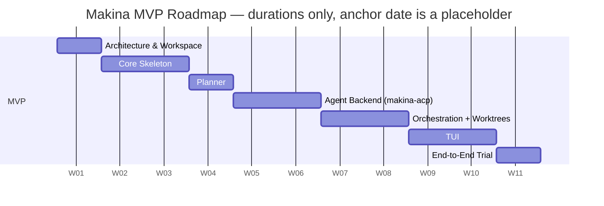

# Roadmap

Names of plans that will follow. Numbers are stable; each plan
elaborates one MVP slice.

## Timeline

> Renders natively on GitHub. The anchor date is a placeholder; only
> relative durations and dependencies are meaningful. Refine as each
> plan is scoped.

## MVP plans

- **0002 — Architecture & Workspace.** Cargo workspace bootstrap
  (`makina-core`, `makina-acp`, `makina`), dependency pinning, module
  layout, the **agent-backend trait** boundary, public
  `makina-core::api` surface, the **star actor topology** (Supervisor
  hub) and supervision tree, concurrency defaults.

- **0003 — Core Skeleton.** Task model with the explicit task state
  machine (`new`, `ready`, `in-progress`, `in-review`, `done`,
  `failed`) including the Developer's gate-iteration self-loop on
  `in-progress`; the four actor traits (Supervisor, Planner,
  Developer, Reviewer) and the agent-backend trait, with a
  `NoopBackend` test stub; **two-layer TOML configuration loading**
  (`~/.makina/config.toml` global + `makina.toml` project, project
  wins); testable without a TUI. Establishes the testing strategy.

- **0004 — Planner.** The Planner actor: interprets a structured-
  text task list into `.tasks/{slug}.json` via a model call, then
  hands the graph to the Supervisor (the only `.tasks/` writer).
  **Identifies cross-cutting dependencies** (tasks touching the same
  files/areas) and encodes them as edges so they serialize instead
  of colliding in parallel. Defines the runtime artifact schema
  (including the dependency model and the "ready" definition) and
  the structured-text convention (likely markdown). Decides the
  Planner's model-call mechanism — direct API vs. one-shot agent
  backend — and the auth surface that follows.

- **0005 — Agent Backend (`makina-acp`).** Implements core's
  agent-backend trait against ACP: subprocesses an ACP-compatible
  CLI and speaks the protocol over stdio. Inherits the CLI's own
  authentication (the Zed model — the CLI is already signed in;
  Makina doesn't manage model credentials). Same backend serves
  Developer and Reviewer roles via different prompts.

- **0006 — Orchestration + Worktrees.** The Supervisor as hub
  driving the full loop — a mix of deterministic steps and agent
  prompts (mechanical for dispatch/merge/state, agent-driven for
  judgment). Worktree + branch lifecycle: create `task/{task-id}`
  off `develop` and a worktree at `.worktrees/{task-id}/` on
  dispatch; Developer and Reviewer share that worktree; squash-merge
  into `develop` on approval; tear down on completion. Task hand-off
  to Developer and Reviewer (which talk only to the Supervisor,
  never each other). **Developer-side gate iteration** with its own
  cap; Reviewer iteration with its own cap. Gate configuration shape
  (global command list; per-task override deferred). Squash-merge
  conflict handling (Planner-encoded dependencies prevent most; the
  Supervisor reconciles stragglers via agent prompt). State
  transitions through the machine from 0003. Concurrency across
  tasks (single Developer per task).

- **0007 — TUI.** The system's entry point. A **file browser** opens
  a task list, which becomes a **Run** in the left sidebar (one Run
  per opened task list, backed by its `.tasks/{slug}.json`).
  `ratatui` scaffold: run control, per-task live status, and **live
  streaming of the prompts and answers exchanged through ACP** for
  the currently-focused agent. Settles the sidebar vocabulary (Run
  is the working term).

- **0008 — End-to-End Trial.** Author a small structured task list
  for a concrete coding task in this repo; run it through the full
  loop; observe and judge.

## After the MVP

See [`FUTURE.md`](FUTURE.md). The MVP test-drive informs what to
pursue, in what order, and at what depth.
